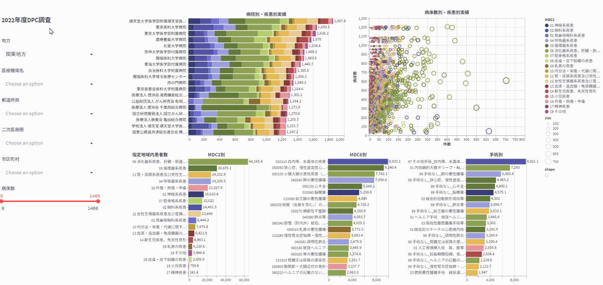

# DPC導入の影響評価に係る調査「退院患者調査」の可視化WEBアプリ

https://dpc-analysis-2022.streamlit.app/

## データの前処理

https://github.com/akira1744/dpc-analysis-preprocessing-2022

## DataSource

[令和4年度DPC導入の影響評価に係る調査「退院患者調査」の結果報告について](https://www.mhlw.go.jp/stf/shingi2/newpage_39119.html)

[診断群分類（DPC) 電子点数表（令和3年11月24日更新）](https://www.mhlw.go.jp/stf/seisakunitsuite/bunya/0000198757_00003.html)

